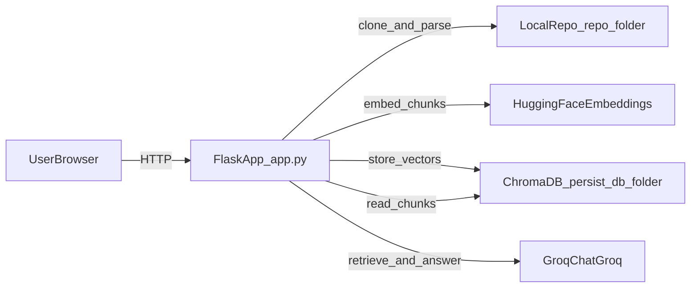
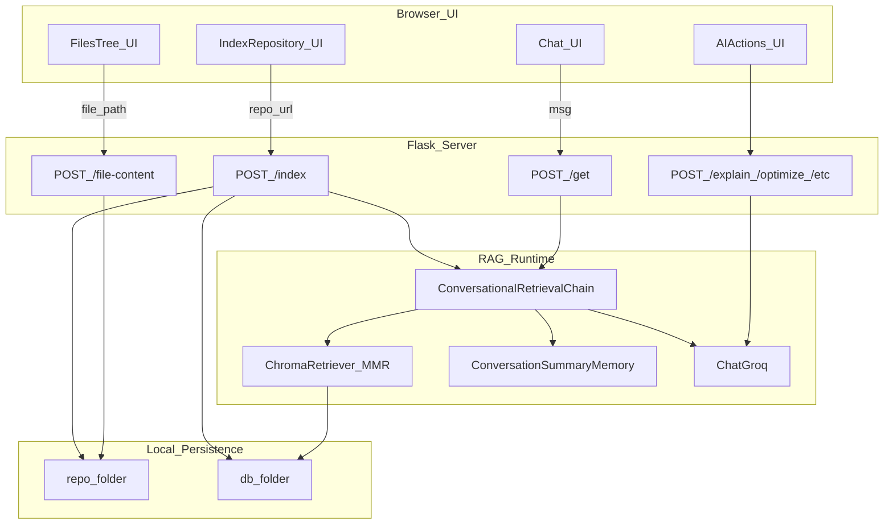
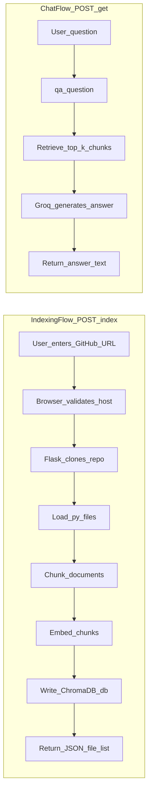
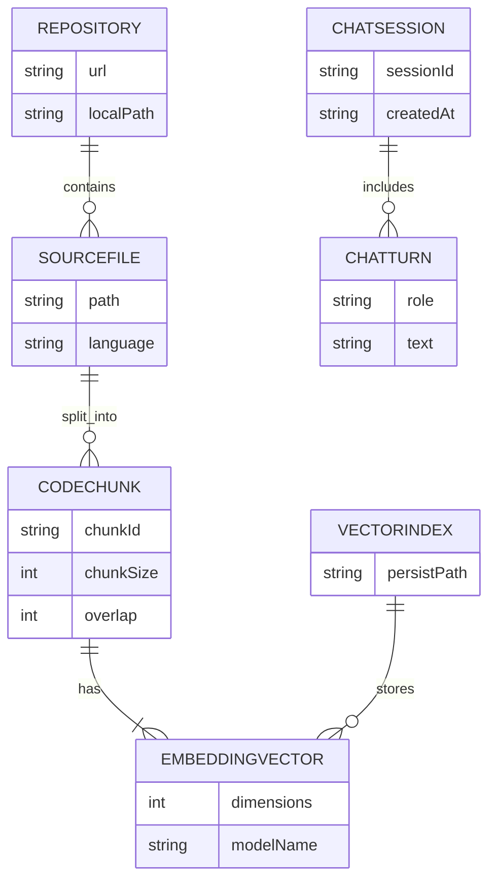
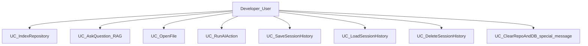
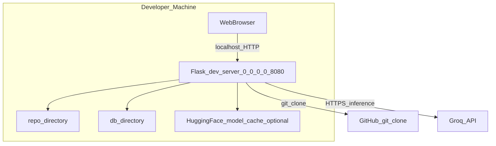

# Real-Time Source Code Analyzer

**Project Type:** Web application (Flask backend + browser UI)  
**Primary Goal:** Help developers explore an unfamiliar GitHub repository faster by combining **repository-grounded retrieval** with an **LLM assistant**, plus lightweight UI workflows for browsing files and running common “AI actions”.

This document follows the chapter structure requested for academic reporting. Page numbers are intentionally omitted (your PDF generator / word processor will compute them).

---

## Table of Contents

1. Chapter 1: Introduction  
   1.1 Background  
   1.2 Problem Statement  
   1.3 Need of the Project  
   1.4 Research Objectives  
   1.5 Scope and Limitations  
   1.6 Project Contributions  
2. Chapter 2: Literature Review  
   2.1 Existing Source Code Analysis Tools  
   2.2 Retrieval-Augmented Generation (RAG)  
   2.3 Vector Databases and Embedding Models  
   2.4 LLMs for Code Understanding  
   2.5 Comparative Analysis Table  
3. Chapter 3: System Architecture and Design  
   3.1 System Overview  
   3.2 Ingestion Pipeline  
   3.3 Retrieval and Query Pipeline  
   3.4 Component Interaction Diagram  
   3.5 Data Flow Diagram  
   3.6 ER Diagram (Conceptual)  
   3.7 Use Case Diagram  
   3.8 Deployment Diagram  
   3.9 Technology Stack  
4. Chapter 4: System Requirements  
   4.1 Hardware Requirements  
   4.2 Software Requirements  
   4.3 Functional Requirements  
   4.4 Non-Functional Requirements  
5. Chapter 5: Implementation  
   5.1 Development Environment Setup  
   5.2 Backend — Flask Application  
   5.3 LangChain RAG Pipeline  
   5.4 ChromaDB Vector Store Integration  
   5.5 Groq LLM Integration  
   5.6 Frontend Chat Interface  
   5.7 Project Folder Structure  
6. Chapter 6: Screenshots and Results  
7. Chapter 7: Testing  
   7.1 Functional Test Cases  
   7.2 Non-Functional Test Cases  
8. Chapter 8: Performance Evaluation  
9. Chapter 9: Conclusion and Future Scope  
   9.1 Conclusion  
   9.2 Future Scope  
10. Bibliography / References  

---

## Chapter 1: Introduction

### 1.1 Background

Modern software systems are large, modular, and rapidly evolving. When engineers onboard to a new repository, they must quickly answer questions such as: Where is the entry point? How does data flow across modules? What are the risky areas to change?

Traditional approaches include reading documentation (often incomplete), tracing execution manually, or relying on static analysis tools. Large Language Models (LLMs) can summarize code, but when used without grounding in the repository they may hallucinate APIs, file paths, or architecture details.

This project implements a **Retrieval-Augmented Generation (RAG)** assistant over an indexed Git repository. The system clones a repository locally, chunks source files, stores embeddings in **ChromaDB**, and answers user queries using **LangChain’s conversational retrieval chain** with **Groq-hosted LLMs**.

### 1.2 Problem Statement

Developers need a tool that:

- Connects a concrete GitHub repository to an assistant (not “generic coding chat”).
- Retrieves relevant code snippets before generating explanations.
- Provides practical UX for browsing files and triggering common tasks (explain/optimize/review).
- Operates as a local prototype suitable for demonstration and evaluation.

### 1.3 Need of the Project

The project addresses gaps between:

- **Pure chat assistants:** fast, but not reliably faithful to a specific repo.
- **Static analyzers:** precise for certain bug classes, but weaker at high-level architectural explanations.

A RAG-based assistant sits between these extremes: it is grounded by retrieval while remaining flexible in natural language interaction.

### 1.4 Research Objectives

1. Design an end-to-end pipeline from **Git clone → chunking → embeddings → vector storage → retrieval QA**.
2. Implement a browser UI that supports repository indexing, chat, file browsing, and “AI actions”.
3. Evaluate feasibility and limitations of a Groq + Chroma + HuggingFace embeddings stack for code understanding tasks.

### 1.5 Scope and Limitations

**In scope**

- Indexing Python (`*.py`) files from a cloned repository into Chroma (as implemented in `app.py`).
- Conversational retrieval QA via `/get`.
- File content viewing via `/file-content` with path sandboxing.
- Action endpoints: `/explain`, `/optimize`, `/find-bugs`, `/convert`, `/comment`.

**Out of scope / limitations**

- Multi-language indexing beyond `.py` in the current indexing route (the loader is configured for Python parsing).
- Multi-user authentication, production-grade deployment, and robust secrets management (prototype assumptions).
- Guaranteed correctness: LLM outputs require human verification; retrieval quality depends on chunking and modeling choices.

### 1.6 Project Contributions

- A working **local** reference implementation of **codebase-grounded Q&A** using LangChain + Chroma + Groq.
- A UI workflow demonstrating practical developer tasks: **index repo**, **ask questions**, **open files**, **run AI actions**, **persist UI session/history client-side**.

---

## Chapter 2: Literature Review

### 2.1 Existing Source Code Analysis Tools

Representative categories:

- **Rule-based static analysis:** linting, security scanning, type checking (e.g., compiler/toolchain diagnostics).
- **Program analysis platforms:** deeper inter-procedural analyses and enterprise workflows (commonly used in CI/CD quality gates).
- **Search/navigation tools:** fast global search, dependency graphs, and IDE navigation.

These tools excel at deterministic signals but can require configuration and may not answer high-level “why” questions in natural language.

### 2.2 Retrieval-Augmented Generation (RAG)

RAG mitigates hallucination by retrieving relevant documents before generation. For code, retrieval typically uses chunked source files and embedding similarity search, optionally reranking.

### 2.3 Vector Databases and Embedding Models

Vector databases store embedding vectors and support similarity queries (cosine distance / inner product depending on configuration). Embeddings map text chunks into a semantic vector space; sentence-transformer models are commonly used for general-purpose semantic retrieval.

### 2.4 LLMs for Code Understanding

LLMs can explain code, propose refactors, and identify risks, but they are sensitive to prompt design and context length. Combining retrieval with structured prompting improves relevance for repository-specific questions.

### 2.5 Comparative Analysis Table

| Approach | Strengths | Typical Weaknesses | Best For |
|---|---|---|---|
| Static analysis tools | Deterministic issues, CI integration | Limited NL explanations | Defect detection in known patterns |
| LLM-only chat | Fast summaries | Hallucination without grounding | General programming help |
| RAG over repo | Grounded answers from retrieved chunks | Retrieval errors; chunking tradeoffs | Repo onboarding + architecture Q&A |
| Hybrid (RAG + tools) | Combines retrieval + structured checks | More engineering complexity | Production-grade dev assistants |

_Fill citations per your academic referencing style (IEEE/APA/etc.)._

---

## Chapter 3: System Architecture and Design

### 3.1 System Overview

The system has three major planes:

1. **Browser UI** (`templates/index.html`, `static/sca-premium.css`)
2. **Flask API** (`app.py`)
3. **AI retrieval stack** (HuggingFace embeddings + Chroma + LangChain + Groq)



### 3.2 Ingestion Pipeline

Ingestion is triggered by `POST /index`:

1. Validate GitHub URL (client-side) and send `repo_url` to server.
2. Server removes prior `./repo` and `./db` directories (full rebuild strategy).
3. Clone repository into `./repo` via `gitpython`.
4. Load `*.py` files using `GenericLoader` + `LanguageParser` (Python).
5. Split documents using `RecursiveCharacterTextSplitter.from_language(Python)`.
6. Create a new Chroma store from chunked documents (persisted to `./db`).
7. Rebuild global QA chain + memory objects so subsequent chat uses the new index.

### 3.3 Retrieval and Query Pipeline

Chat uses `POST /get`:

1. User message is passed to `ConversationalRetrievalChain` (`qa({"question": ...})`).
2. Retriever uses **MMR** search with `k=3` (as configured in `app.py`).
3. Conversation memory (`ConversationSummaryMemory`) summarizes chat history for context window management.

### 3.4 Component Interaction Diagram



### 3.5 Data Flow Diagram



### 3.6 ER Diagram (Conceptual)

This project does not use a relational database for chat/index storage; persistence is primarily **filesystem + Chroma**. The ER diagram below models conceptual entities.



### 3.7 Use Case Diagram



_Note:_ history persistence is implemented client-side using browser `localStorage` (see Chapter 5.6).

### 3.8 Deployment Diagram



### 3.9 Technology Stack

| Layer | Technology | Role in this project |
|---|---|---|
| UI | HTML/CSS + vanilla JS | Single-page UI in `templates/index.html` |
| Web framework | Flask | Routes and JSON APIs (`app.py`) |
| Orchestration | LangChain | Document loading, splitting, retrieval chains |
| Vector DB | Chroma | Persist embeddings in `./db` |
| Embeddings | HuggingFace `sentence-transformers/all-MiniLM-L6-v2` | Chunk embeddings (`src/helper.py`) |
| LLM inference | Groq (`langchain_groq.ChatGroq`) | Answering + action prompts |
| Git integration | GitPython | Clone repositories |

---

## Chapter 4: System Requirements

### 4.1 Hardware Requirements

**Minimum (typical developer laptop)**

- CPU: modern multi-core processor
- RAM: 8 GB (16 GB recommended for smoother embedding/model caching)
- Disk: sufficient space for cloned repositories + vector DB + model cache

**Notes**

- Embedding models may download weights on first run (network + disk).
- Large repositories increase indexing time and storage usage.

### 4.2 Software Requirements

- **Python:** 3.10+ recommended (matches common conda instructions in project docs)
- **Operating system:** macOS / Linux / Windows (Flask + paths used are cross-platform; cloning requires git available to GitPython)
- **Key Python packages:** see `requirements.txt` (LangChain ecosystem, Chroma, Groq integration, GitPython, sentence-transformers)

**Environment variables**

- `GROQ_API_KEY` is required for Groq chat + action endpoints (`app.py` reads `os.getenv("GROQ_API_KEY")`).

_Documentation note:_ the repository `README.md` historically mentions OpenAI keys; the implemented backend uses Groq + `GROQ_API_KEY`. Treat README inconsistencies as documentation drift (correct in Chapter 5.1 / updated README).

### 4.3 Functional Requirements

| ID | Requirement | Evidence |
|---|---|---|
| FR-01 | User can index a GitHub repository | `POST /index` + UI `handleIndex()` |
| FR-02 | User can ask natural-language questions grounded by retrieval | `POST /get` + `ConversationalRetrievalChain` |
| FR-03 | User can browse indexed files list | UI renders returned file list from `/index` |
| FR-04 | User can open file contents safely | `POST /file-content` + `_read_repo_file()` sandbox |
| FR-05 | User can run AI actions on selected code or full file | `/explain`, `/optimize`, `/find-bugs`, `/convert`, `/comment` |
| FR-06 | User can persist UI sessions locally | `localStorage` keys such as `sca_history` |

### 4.4 Non-Functional Requirements

| Category | Requirement | Notes |
|---|---|---|
| Usability | Workspace tabs, file browsing, chat affordances | Modern UI layout |
| Performance | Interactive indexing + chat | Depends on repo size + hardware |
| Security | Path traversal protection for file reads | `_read_repo_file()` restricts reads under `./repo` |
| Reliability | Recovery from failed indexing | UI shows toast errors; server returns JSON errors |
| Maintainability | Single Flask module + template-driven UI | Straightforward structure |

---

## Chapter 5: Implementation

### 5.1 Development Environment Setup

Recommended setup:

```bash
conda create -n llmapp python=3.10 -y
conda activate llmapp
pip install -r requirements.txt
```

Create a `.env` file in the project root:

```ini
GROQ_API_KEY="YOUR_KEY_HERE"
```

Run the server:

```bash
python app.py
```

Open:

`http://localhost:8080`

_(Port is defined in `app.py` as `8080`.)_

### 5.2 Backend — Flask Application

Core routes in `app.py`:

| Route | Method | Purpose |
|---|---|---|
| `/` | GET/POST | Serve UI (`render_template('index.html')`) |
| `/index` | POST | Clone + rebuild Chroma + return file list JSON |
| `/get` | POST | RAG chat (`qa({"question": ...})`) |
| `/file-content` | POST | Read file from `./repo` safely |
| `/explain`, `/optimize`, `/find-bugs`, `/convert`, `/comment` | POST | Structured prompts executed via Groq |

**Special chat message:** sending `clear` (case-insensitive) deletes `./repo` and `./db` on the server.

### 5.3 LangChain RAG Pipeline

The runtime uses:

- `Chroma` persisted at `./db`
- `ConversationalRetrievalChain.from_llm(...)`
- Retriever: `search_type="mmr"` with `k=3`

During indexing (`POST /index`), the global `qa` and `memory` objects are rebuilt so chat uses the freshly embedded repository.

### 5.4 ChromaDB Vector Store Integration

- Persist directory: `./db`
- Index rebuild strategy: delete old `./db` during `/index` before creating a new store.

### 5.5 Groq LLM Integration

- Model configured in code: `ChatGroq(model="llama-3.1-8b-instant", temperature=0)`
- Actions (`_run_action_prompt`) build structured prompts for explain/optimize/etc., including truncated code for safety.

### 5.6 Frontend Chat Interface

Major UI capabilities:

- **Indexing:** validates GitHub hostname client-side, calls `/index`, stores `sca_repo` and `sca_indexed_files` in `localStorage`.
- **Chat:** posts to `/get` with `msg` field.
- **Workspace tabs:** Chat / Files / History / Settings / AI Insights (right-side workspace layout).
- **File viewer + actions:** loads file content via `/file-content`; posts actions to endpoints mapped by `endpointForAction()`.
- **Insights panel:** heuristic summaries/complexity suggestions based on filename/path patterns (not LLM-derived).

Representative client-side persistence keys:

- `sca_repo`, `sca_indexed_files`, `sca_current_chat`, `sca_history`, `sca_active_tab`, layout keys such as `sca_col_widths`, `sca_right_collapsed`

### 5.7 Project Folder Structure

```
Real-Time-Scource-Code-Analyzer/
  app.py                 # Flask server + RAG wiring + routes
  requirements.txt       # Python dependencies (high-level pins)
  templates/index.html   # Main UI + client-side logic
  static/sca-premium.css # Styling
  src/helper.py          # Embeddings helper + legacy ingestion helpers
  db/                    # Chroma persistence (generated at runtime)
  repo/                  # Cloned repository (generated at runtime)
```

---

## Chapter 6: Screenshots and Results

Place exported screenshots under `assets/screenshots/` (folder created for your convenience).

Suggested filenames:

| File | What to capture |
|---|---|
| `assets/screenshots/01-home.png` | Initial UI state |
| `assets/screenshots/02-indexing.png` | Indexing progress bar visible |
| `assets/screenshots/03-sidebar-files.png` | Indexed files list populated |
| `assets/screenshots/04-chat.png` | Chat response rendered |
| `assets/screenshots/05-file-viewer.png` | Active file viewer open |
| `assets/screenshots/06-ai-actions.png` | Action output shown |
| `assets/screenshots/07-history.png` | Saved sessions list + delete |
| `assets/screenshots/08-settings.png` | Settings panel |

_Checklist_

- Capture both **dark** and **light** theme if required by your report guidelines.
- Include at least one screenshot showing **GitHub URL validation error** and one showing **successful indexing**.

---

## Chapter 7: Testing

### 7.1 Functional Test Cases

| TC ID | Preconditions | Steps | Expected Result |
|---|---|---|---|
| TC-F-01 | App running | Enter valid GitHub URL → Index | JSON `status=ok`, files populate sidebar |
| TC-F-02 | Repo indexed | Ask question in chat | Answer returned from `/get` |
| TC-F-03 | Repo indexed | Click file in sidebar | `/file-content` loads code in viewer |
| TC-F-04 | File open | Run Explain action | JSON `status=ok`, output displayed |
| TC-F-05 | Chat exists | Save session | `sca_history` grows; History count increments |
| TC-F-06 | History exists | Delete one session | Session removed; persists after refresh |
| TC-F-07 | Repo indexed | Send `clear` message | Server clears `./repo` + `./db` |

### 7.2 Non-Functional Test Cases

| TC ID | Scenario | Expected |
|---|---|---|
| TC-NF-01 | Large repository indexing | Completes or fails gracefully with error JSON + UI toast |
| TC-NF-02 | Missing `GROQ_API_KEY` | Chat/actions fail predictably (document observed behavior) |
| TC-NF-03 | Path traversal attempt in `/file-content` | Request rejected / file not found |

---

## Chapter 8: Performance Evaluation

Because this project is a prototype, treat performance evaluation as **qualitative + simple timing experiments**:

- **Indexing time vs repository size:** measure wall-clock time from clicking Index until success toast.
- **Chat latency:** measure time from sending prompt to first rendered answer (network + Groq inference).
- **Retrieval quality:** manual rubric (correct file mentioned? relevant snippet retrieved?) across a small benchmark question set.

Recommended reporting format:

- Table: repo size (LOC/files), index time, average chat latency over N questions.
- Short discussion of failure modes: retrieval misses, chunk boundaries, model truncation.

---

## Chapter 9: Conclusion and Future Scope

### 9.1 Conclusion

The project demonstrates a practical workflow for **repository-grounded code assistance** using a modern stack: Flask for orchestration, LangChain for RAG, Chroma for vector storage, HuggingFace embeddings for retrieval, and Groq for fast inference. The UI connects these capabilities into a cohesive developer-oriented experience: indexing, browsing, chatting, and targeted AI actions.

### 9.2 Future Scope

- **Multi-language ingestion:** extend beyond `.py` by configuring loaders/splitters per language.
- **Incremental indexing:** avoid wiping `./db` each time; update only changed files.
- **Authentication + multi-user isolation:** move secrets and storage from local prototype to secure services.
- **Evaluation harness:** automated retrieval metrics (nDCG/MRR) and code-specific benchmarks.
- **IDE integration:** inline assistant inside VS Code/JetBrains using the same backend APIs.

---

## Bibliography / References

Fill using your institution’s citation style. Starter sources to cite:

- LangChain documentation (Retrieval, Conversational chains)
- Chroma documentation (persistence, retrieval)
- Groq API / ChatGroq integration notes
- HuggingFace Sentence Transformers / `all-MiniLM-L6-v2` model card
- Retrieval-Augmented Generation (original / survey papers per your course requirements)

---

## Appendix A: API Summary (Implemented)

| Endpoint | Request shape | Response |
|---|---|---|
| `POST /index` | `repo_url` form field | `{status, files}` |
| `POST /get` | `msg` form field | Plaintext answer |
| `POST /file-content` | `file_path` | JSON with `content` |
| `POST /explain` etc. | `file_path`, `file_content`, optional `selected_code`, optional `target_language` | JSON with `result` |
